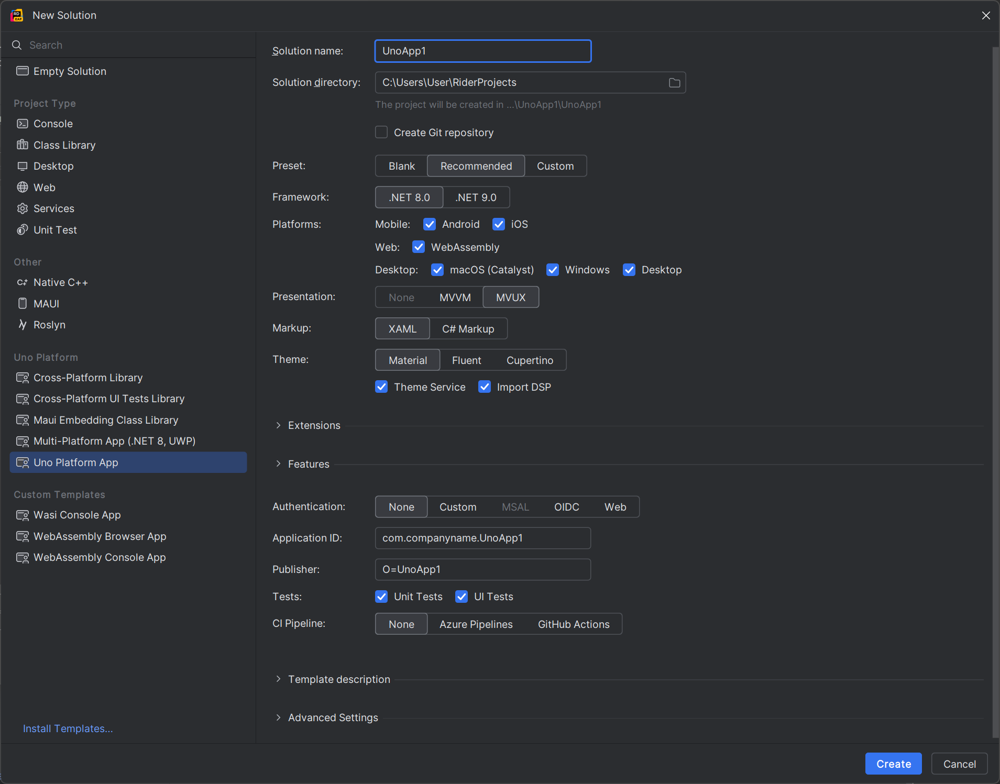

Rider Uno Sample
----------------
This plugin demonstrates the use of project templates embedded into a Rider plugin. Here's how it looks in the IDE:



Note that the original Uno templates are unpacked into the `/projectTemplates/` directory. They are published as part of the plugin.

Usage
-----
1. Build your plugin (the built ZIP file goes into `build/distributions`):
   ```console
   $ ./gradlew :buildPlugin
   ```
2. Run the tests:
   ```console
   $ ./gradlew :check
   ```
3. Run a test instance of Rider with your plugin:
   ```console
   $ ./gradlew :runIde
   ```

License
-------
Apache 2 License, see [the `LICENSE` file][docs.license].

Copyright 2024 JetBrains s.r.o.
